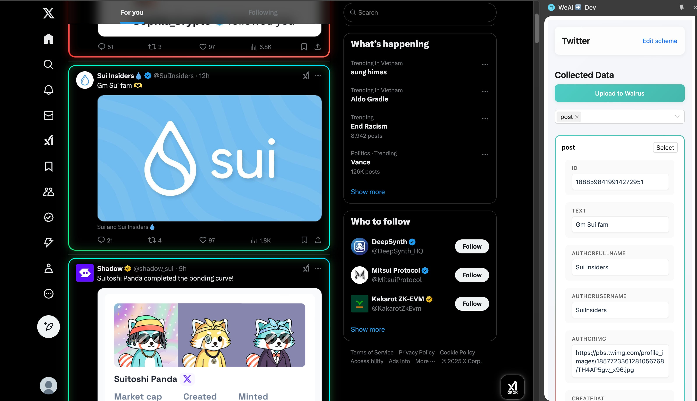
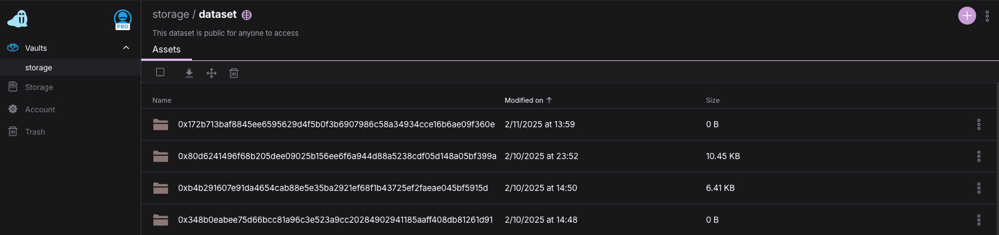

# Flyfish Extension 🐟

A browser extension that empowers users to collect, filter, and store web data in the **Tusky (Walrus)** decentralized storage system, creating a personalized knowledge base for the **Flyfish Agent**.

## Overview

The Flyfish Extension is a core component of the **Flyfish ecosystem** that provides:

- Seamless **web data collection** and extraction
- Customizable **content filtering** capabilities with support of **FlyFish Agent**
- Secure **decentralized storage** integration with Tusky/Walrus
- Direct integration with the **Flyfish chat** interface for data access

## Key Features

### Data Collection
- Extract **structured** and **unstructured data** from any website
- Support for multiple data formats and content types
- **Real-time** data capture through the browser interface

### Content Filtering
- **Advanced filtering** mechanisms based on user-defined criteria with support of **FlyFish Agent**

### Decentralized Storage
- Seamless integration with the **Tusky (Walrus)** decentralized storage system
- Secure **per-address data isolation**
- Support for structured and unstructured **JSON** data formats

## Tusky (Walrus) Integration

The extension leverages Tusky's **decentralized storage** capabilities to ensure secure and persistent data storage:

### Data Organization
- Each **Sui address** maintains an isolated data folder
- **Personalized** storage structure for individual users

### Data Format

The system supports:
- Structured and unstructured JSON data
- Flexible schema design
- Custom data formats based on agent requirements

## Ecosystem Integration

Flyfish Extension is part of a comprehensive ecosystem:

- [**Flyfish Chat**](https://github.com/Weminal-labs/flyfish-chat)
  - Web interface for data interaction

- [**Flyfish Agent**](https://github.com/tung-lee/flyfish-agent)
  - **Advanced data processing** capabilities
  - **AI-powered** analysis
  - Automated information extraction

- [**Sui Plugin**](https://github.com/tung-lee/eliza/tree/main/packages/plugin-sui)
  - **Blockchain** integration layer
  - Secure transaction handling
  - **Decentralized identity** management

## License

This project is licensed under the MIT License. See the LICENSE file for complete details.
